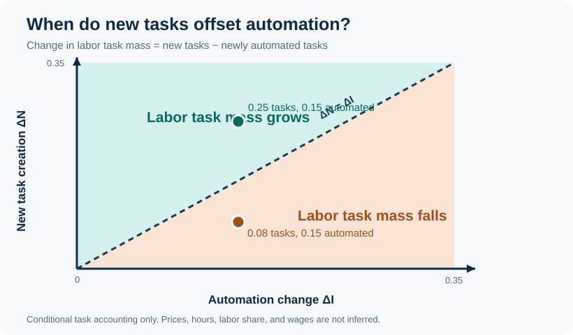

# Repository 6: Acemoglu and Restrepo (2018)

**The Race between Man and Machine: Implications of Technology for Growth, Factor Shares, and Employment.** *American Economic Review* 108(6), pages 1488 to 1542. [DOI](https://doi.org/10.1257/aer.20160696) · [NBER working paper 22252](https://www.nber.org/papers/w22252) · [course issue](https://github.com/alexanderquispe/AI-Econ-Modeling/issues/5)

This repository reads the **NBER version revised in June 2017 (87 pages)**. The pinned PDF has SHA-256 `441d01202afd56ef8002fc24ffc2beb51191741c0b5accb11d2534620dd616b7`. Result and page numbering below refer to that version.

## Question and economic mechanism

When does automation reduce labor's share, employment, or the real wage, and when can new tasks reverse those effects? A unit measure of tasks occupies

$$i\in[N-1,N].$$

Tasks up to the technological frontier $I$ can use capital; tasks above it require labor. Because labor productivity $\gamma(i)$ rises with task complexity, competitive firms assign lower-index tasks to capital. The effective automation threshold and the cost-equality threshold satisfy

$$I^{\ast}=\min(I,\widetilde I),
\qquad
\frac{W}{R}=\gamma(\widetilde I).$$

Raising $I$ displaces labor from existing tasks. Raising $N$ introduces new tasks that use labor and replaces the least complex old tasks, reinstating labor.

## The agents' problems

**Firms.** For every task with $i\le I$, firms compare the rental price of capital $R$ with the effective labor cost $W/\gamma(i)$. For $i>I$, only labor is technologically feasible (equation 5). The full unit price also reflects the intermediate-input share $\eta$.

**Household.** A representative household chooses consumption $C$ and labor $L$ subject to

$$C=WL+RK,
\qquad
\nu'(L)=\frac{W}{C},$$

where $\nu(L)$ is increasing and convex labor disutility.

**Equilibrium.** Capital $K$ and technology $(I,N)$ are fixed in the static model. Factor prices, output, labor supply, and the effective task threshold clear competitively.

## Main results and conditions

Propositions 1 to 3 maintain three central conditions:

1. $\gamma(i)$ is strictly increasing.
2. Either the intermediate-input share tends to zero, $\eta\to0$, or its substitution elasticity satisfies $\zeta=1$.
3. $K<\bar K$, as defined in the paper, so the newest task is used.

The comparative statics also use

$$\sigma>0,
\qquad
\widehat\sigma=\sigma(1-\eta)+\zeta\eta>0,
\qquad
\varepsilon_L>0.$$

In the base environment, $\eta\in(0,1)$, $\zeta>0$, and $K>0$. The labor-disutility function $\nu$ is continuously differentiable, increasing, convex, and satisfies

$$\nu''(L)+\frac{\theta-1}{\theta}\bigl(\nu'(L)\bigr)^2>0.$$

When automation is **technology constrained**, Proposition 2 gives

$$I^{\ast}=I<\widetilde I,
\qquad
\frac{d\ln(W/R)}{dI}
=-\frac{\Lambda_I}{\widehat\sigma+\varepsilon_L}<0,
\qquad
\Lambda_I>0.$$

The labor share and normalized wage are

$$s_L=\frac{WL}{WL+RK}=\frac{WL}{(1-\eta)Y},
\qquad
\omega=\frac{W}{RK}.$$

Because $K$ is fixed in this comparative static, $d\ln\omega=d\ln(W/R)$. The labor share and employment therefore fall in the constrained case. Proposition 3 separates the positive **productivity effect** from **displacement**:

$$P_I=\frac{d\ln Y\vert_{K,L}}{dI},
\qquad
\frac{d\ln W}{dI}
=P_I-\frac{(1-s_L)\Lambda_I}{\widehat\sigma+\varepsilon_L}.$$

Consequently,

$$\boxed{
\frac{d\ln W}{dI}>0
\iff
P_I>\frac{(1-s_L)\Lambda_I}{\widehat\sigma+\varepsilon_L}
}.$$

The real wage rises when productivity dominates displacement, falls when the inequality reverses, and is locally unchanged at equality. Thus automation does not necessarily reduce wages.

**Slack frontier.** If $I^{\ast}=\widetilde I<I$, a marginal increase in $I$ has no effect on factor prices or the labor share. At the kink $I^{\ast}=I=\widetilde I$, the paper requires derivatives from each side.

By contrast, creating new tasks ($N\uparrow$) raises $W/R$, employment, labor share, and the wage under the same maintained assumptions. This is the reinstatement effect. The static statements do not by themselves establish that the wage falls in the long run: capital accumulation changes that conclusion.

## Checked extension: joint task changes

Suppose the technology frontier binds both before and after simultaneous changes in automation and task creation. If both cutoffs lie inside their task intervals, the measure of labor tasks changes by

$$\Delta m_L=\Delta N-\Delta I,\qquad \Delta m_L>0\iff\Delta N>\Delta I.$$

This is a task allocation result, not a wage or employment prediction. [The derivation](extensions.md) states the conditions, [the Python example](analysis/joint_task_extension.py) illustrates both signs, and [Lean proves the identity and strict comparison](lean/JointTaskExtension.lean).

## Lean formalization and verification

The `lean/` folder is the complete `papers/AR18RaceManMachine/` folder from our own [AppliedModelingLib](https://gargnikhil.com/AppliedModelingLib/) clone. The initial formalization used `gpt-5.6-sol` at `xhigh` reasoning. The joint task extension was added later in that same clone, checked by Lean, and then copied with the full folder without reorganizing its files. Ordinary `git add lean/` respects the generated `.gitignore`, so the private source PDF and extracted text are not published.

| Checked support result | Scope |
|---|---|
| [Task threshold and allocation](lean/StaticModel.lean) | The task interval, cost cutoff, displacement, and new-task mass with an explicit fixed cutoff. |
| [Appendix B bridges](lean/ComparativeStatics.lean) | Equation (13) to (B10), and fixed-factor income to (B9), under stated differentiability and nonzero assumptions. |
| [Wage equality and sign condition](lean/MainTheorems.lean) | The wage response to automation conditional on those model identities. |
| [Joint task extension](lean/JointTaskExtension.lean) | The exact change in labor task mass when automation and new tasks change together under feasible binding cutoffs. |

The [build and required fast check](checks/lean-fast-check.txt) passed. The [run handoff](lean/docs/RUN_HANDOFF.md) and [status file](lean/status.json) identify the remaining proof obligations. **Status: partially formalized.** No complete named proposition or full equilibrium is claimed.

## Repository materials

- [`analysis/wage_condition.py`](analysis/wage_condition.py) checks the Proposition 3 sign inequality using illustrative comparative-static inputs.
- [`presentation.tex`](presentation.tex) and [`presentation.pdf`](presentation.pdf) provide the 20 minute deck, including a graphic and Lean proof for the extension.
- [`prompts.md`](prompts.md) records the Repository 6 instructions, our prompts, and the relevant responses from the actual run.
- [`hand/derivation.jpg`](hand/derivation.jpg) is the genuine handwritten derivation used in the presentation; [`hand/README.md`](hand/README.md) summarizes the calculation.

[Original course repository](https://github.com/alexanderquispe/AI-Econ-Modeling)
